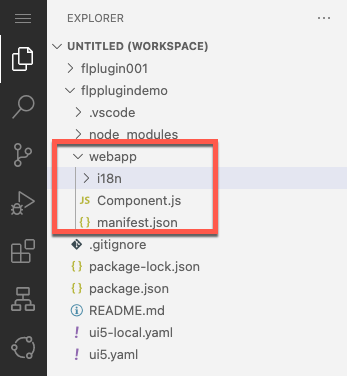

# CREATING AND DEPLOYING AN SAP FIORI LAUNCHPAD PLUGIN IN SAP BUSINESS APPLICATION STUDIO

## Introduction
In this section you will find the required steps to create a new SAP Fiori Launchpad Plugin project in SAP Business Application Studio.

## Create a new BAS project
You should start by creating a new BAS project using the standard project generators for a freestyle application. To do this follow the next steps:

61. Launch BAS. Once loaded, go to **File >> New Project from Template**.

  

62. Select **SAP Fiori Application** generator and click on **Start**

  

63. Select **SAPUI5 freestyle** from **application type** dropdown, followed by selecting the **SAPUI5 Application** generator and clicking on **Next**.

  

64. Select **Data source = None** and click on **Next**.

  

65. Use default value for field **View name** and click on **Next**.

  

66. Enter the following details and click on **Finish**:

| **Parameter**                 | **Value**                                                                        |
|-------------------------------|------------------------------------------------------------------------------|
| Module Name:                  | **< Your plugin module name >** (for example: **flpplugindemo**)               |
| Application Title:            | **< Your plugin title >** (for example: **FLPplugin demo**)                    |
| Application Namespace:        | **< Your plugin namespace >** (for example: **com.sap.rig.demoplugin**)        |
| Description:                  | **< Your plugin description >** (for example: **A Fiori plugin**)              |
| Project folder path:          | **< Your project root folder in BAS >** (for example: **/home/user/projects**) |
| Minimum SAPUI5 version:       | **< Your backend system SAPUI5 library version >** (for example: **1.109.3**)  |
| Add deployment Configuration: | **No**                                                                       |
| Add FLP configuration         | **No**                                                                       |
| Configure advanced options    | **No**                                                                       |

  

67. Once the project is generated you should find a new folder in your workspace containing the folder structure of the project.

  

## Adapt Generated Project
The generated project is created as a freestyle application, meaning it is considering navigation routers, controllers and views to be displayed as an SAP Fiori app. Unfortunately, in our case we need to create an SAP Fiori Launchpad Plugin, which is the simplest form of an app and is actually called a **Component**.

Follow the next steps to adjust the current project structure to behave as an SAP Fiori Component.

68. You will need to delete the following folders and their contents by right clicking on the folder and selecting **Delete Permanently** from the menu.

| Folder to delete |
|------------------|
| controller       |
| css              |
| model            |
| test             |
| utils            |
| view             |

  

69. Once all mentioned folders are deleted, you should also delete the **index.html** file.

  

70. With all files and folder deleted, your project should only contain the i18n folder, component.js and manifest.json files.

  

**NOTE** - As we have modified the project structure and deleted test files, you will not be able to test the plugin from BAS, you would need to deploy the plugin to the on-premise system for testing.

## Adapt Component.js and Manifest.json files
In this section you will modify the manifest.json and component.js files to setup the SAP Fiori Launchpad plugin and include business logic to make a call to your custom HTTP service (created in [Exercise 3](../ex_3)).

71. Open the manifest.json file in your project and take note of the value of the **ID** parameter.

  

72. Copy the code from the [sample manifest.json](sources/manifest.json) file into your code.

  

  **NOTE** - Plugins do not require additional definitions, this would be the simplest version of a manifest.json file and the base for creating an FLP plugin.

73. Edit the values of parameters **ID** and **componentName** with the value you identified on **Step 71**.

  

74. Open the Component.js file in your project and take note of the value of the **Full Component Name** value from the **return UIComponent.extend** statement.

  

75. Copy the code from the [sample manifest.json](sources/manifest.json) file into your code.

  

  **NOTE** - Plugins do not require additional definitions, this would be the simplest version of a manifest.json file and the base for creating an FLP plugin.

76. Edit the values of parameters **ID** and **componentName** with the value you identified on **Step 71**.

  

## What does this code do?
In this section we will briefly explain what the copied code is doing.

## Next Steps
In the next section you will activate your custom SAP Fiori Launchpad Plugin on your ABAP platform.

To continue with this exercise go to [Exercise 5](../ex_5)
